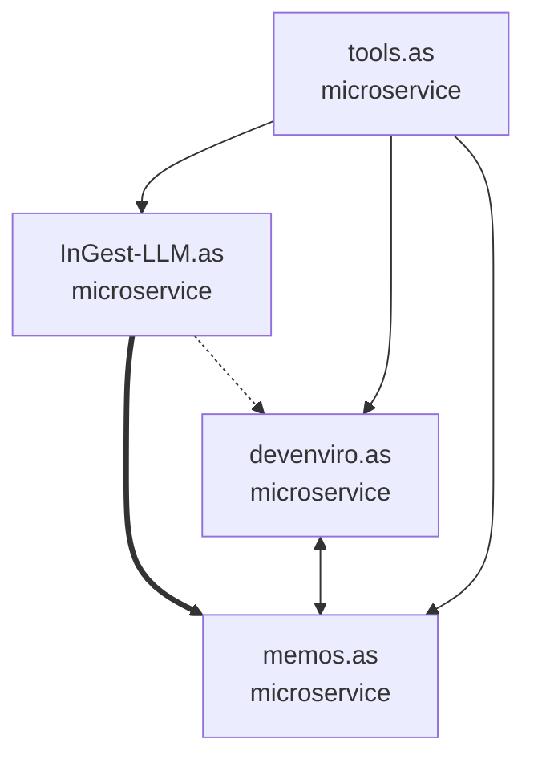

# Qwen Model Integration for Project Analysis

## 🤖 **Overview**

The InGest-LLM.as service now includes powerful project analysis capabilities using the local **qwen/qwen3-4b-thinking-2507** model. This integration provides AI-powered analysis of the entire ApexSigma ecosystem, generating comprehensive project outlines and flow diagrams that show relationships between services.

## 🎯 **Capabilities**

### **Project Analysis**
- **Comprehensive outlines** for each ApexSigma project
- **Architecture type identification** (microservice, monolith, etc.)
- **Core component analysis** with detailed descriptions
- **API endpoint discovery** and documentation
- **Data model identification** and relationships
- **Service dependency mapping**
- **Key feature extraction** and categorization

### **Relationship Mapping**
- **Cross-project dependencies** analysis
- **Communication protocol identification** (HTTP/REST, Database, Memory)
- **Data flow direction** mapping (bidirectional, source→target, target→source)
- **Integration point** discovery and documentation

### **Visual Diagrams**
- **Mermaid flow diagrams** showing complete ecosystem architecture
- **Service relationship visualization** with different arrow types
- **Interactive diagrams** for web display
- **Export capabilities** for documentation

## 🏗️ **Architecture**

### **Core Components**

#### **QwenProjectAnalyzer** (`src/ingest_llm_as/services/project_analyzer.py`)
- **Project discovery** and structure analysis
- **Code content extraction** and preprocessing
- **Qwen model communication** with structured prompts
- **Response parsing** and data structuring
- **Relationship analysis** and mapping

#### **Analysis API** (`src/ingest_llm_as/api/analysis.py`)
- **REST endpoints** for project analysis
- **Real-time analysis** with comprehensive results
- **Single project** and ecosystem-wide analysis
- **Diagram generation** and export

#### **Analysis Script** (`scripts/qwen_project_analysis.py`)
- **Command-line interface** for project analysis
- **Batch processing** of all projects
- **Output formatting** and file export
- **Interactive demonstration** of capabilities

## 🌐 **API Endpoints**

### **POST /analysis/projects**
Comprehensive ecosystem analysis using Qwen model.

**Request:**
```json
{
  "include_diagrams": true,
  "detail_level": "comprehensive"
}
```

**Response:**
```json
{
  "analysis_id": "qwen_analysis_20240817_143022",
  "timestamp": "2024-08-17T14:30:22.123Z",
  "projects": [
    {
      "project_name": "InGest-LLM.as",
      "description": "Data ingestion microservice...",
      "architecture_type": "microservice",
      "core_components": [
        {
          "name": "RepositoryProcessor",
          "description": "Processes repository content...",
          "type": "service"
        }
      ],
      "api_endpoints": [
        {
          "method": "POST",
          "path": "/ingest/text",
          "description": "Ingests text content..."
        }
      ],
      "dependencies": ["memOS.as", "LM Studio"],
      "key_features": ["Repository ingestion", "AST parsing"]
    }
  ],
  "relationships": [
    {
      "source": "InGest-LLM.as",
      "target": "memos.as",
      "relationship_type": "stores_in",
      "protocol": "HTTP/REST",
      "description": "Stores processed content in memory tiers",
      "data_flow": "source_to_target"
    }
  ],
  "architecture_summary": "The ApexSigma ecosystem follows a microservices architecture...",
  "mermaid_diagram": "graph TD\n    InGest_LLM_as[InGest-LLM.as<br/>microservice]\n..."
}
```

### **GET /analysis/projects/{project_name}**
Analyze a single project with detailed breakdown.

### **GET /analysis/relationships**
Get detailed relationship mapping between all projects.

### **GET /analysis/diagram/mermaid**
Generate Mermaid flow diagram in text or HTML format.

**Query Parameters:**
- `format`: `text` | `html` (default: `text`)

### **GET /analysis/architecture-summary**
Get comprehensive architecture summary with integration patterns.

## 🚀 **Usage Examples**

### **Command Line Analysis**

#### **Full Ecosystem Analysis**
```bash
# Comprehensive analysis of all projects
python scripts/qwen_project_analysis.py

# Save results to files
python scripts/qwen_project_analysis.py --save-output
```

#### **Single Project Analysis**
```bash
# Analyze specific project
python scripts/qwen_project_analysis.py --single InGest-LLM.as
python scripts/qwen_project_analysis.py --single memos.as
```

#### **Diagram Generation**
```bash
# Generate only the flow diagram
python scripts/qwen_project_analysis.py --diagram-only
```

### **API Usage**

#### **Start the Service**
```bash
# Ensure Qwen model is running
# LM Studio with qwen/qwen3-4b-thinking-2507 on localhost:1234

# Start InGest-LLM.as
poetry run uvicorn src.ingest_llm_as.main:app --reload
```

#### **Trigger Analysis**
```bash
# Full ecosystem analysis
curl -X POST http://localhost:8000/analysis/projects \
  -H "Content-Type: application/json" \
  -d '{"include_diagrams": true, "detail_level": "comprehensive"}'

# Single project analysis
curl http://localhost:8000/analysis/projects/InGest-LLM.as

# Get relationships
curl http://localhost:8000/analysis/relationships

# Get Mermaid diagram
curl http://localhost:8000/analysis/diagram/mermaid

# Get architecture summary
curl http://localhost:8000/analysis/architecture-summary
```

## 🧠 **Qwen Model Integration**

### **Model Requirements**
- **Model**: `qwen/qwen3-4b-thinking-2507`
- **Endpoint**: `http://localhost:1234/v1/chat/completions`
- **Provider**: LM Studio (recommended)
- **Context Window**: 4k+ tokens recommended
- **Temperature**: 0.3 (for consistent analysis)

### **Prompt Engineering**

The system uses carefully crafted prompts for different analysis types:

#### **Project Analysis Prompt**
```
As an expert software architect, analyze the ApexSigma project "PROJECT_NAME" and provide a comprehensive outline.

PROJECT INFORMATION:
- Directory Structure: [directories]
- File Counts: [.py, .md, .json counts]
- Key Files: [README, pyproject.toml, etc.]
- API Files: [main.py, api modules]

Provide analysis in JSON format focusing on:
1. Architecture patterns and design
2. Core components and services
3. API endpoints and data models
4. Dependencies and integrations
5. Key features and capabilities
```

#### **Relationship Analysis Prompt**
```
Analyze relationships between ApexSigma projects:

PROJECTS:
- InGest-LLM.as: Data ingestion microservice...
- memos.as: Memory Operating System...
- devenviro.as: Agent orchestrator...
- tools.as: Development tooling...

Identify how services interact, dependencies, 
communication protocols, and data flows.
```

### **Response Processing**

The system intelligently parses Qwen responses:
- **JSON extraction** from mixed content
- **Error handling** for malformed responses
- **Data validation** and structure verification
- **Fallback strategies** for partial analysis

## 📊 **Analysis Output**

### **Project Outline Structure**
```typescript
interface ProjectOutline {
  project_name: string;
  description: string;
  architecture_type: 'microservice' | 'monolith' | 'library' | 'tool';
  core_components: Array<{
    name: string;
    description: string;
    type: string;
  }>;
  api_endpoints: Array<{
    method: string;
    path: string;
    description: string;
  }>;
  data_models: string[];
  services: Array<{
    name: string;
    description: string;
    type: 'internal' | 'external';
  }>;
  dependencies: string[];
  key_features: string[];
  integration_points: string[];
}
```

### **Relationship Mapping**
```typescript
interface ServiceRelationship {
  source: string;
  target: string;
  relationship_type: 'depends_on' | 'communicates_with' | 'stores_in' | 'orchestrates';
  protocol: 'HTTP/REST' | 'Direct' | 'Database' | 'Memory';
  description: string;
  data_flow: 'bidirectional' | 'source_to_target' | 'target_to_source';
}
```

### **Mermaid Diagram Generation**


## ⚙️ **Configuration**

### **Environment Variables**
```bash
# Qwen model endpoint (default: http://localhost:1234/v1)
QWEN_BASE_URL=http://localhost:1234/v1

# Analysis timeout (default: 60 seconds)
QWEN_TIMEOUT=60

# Model temperature (default: 0.3)
QWEN_TEMPERATURE=0.3
```

### **LM Studio Setup**
1. **Install LM Studio** from https://lmstudio.ai/
2. **Download Model**: Search for and download `qwen/qwen3-4b-thinking-2507`
3. **Start Server**: Load model and start local server on port 1234
4. **Verify**: Test at http://localhost:1234/v1/models

## 🔍 **Example Analysis Results**

### **InGest-LLM.as Analysis**
```json
{
  "project_name": "InGest-LLM.as",
  "description": "Data ingestion microservice for processing and embedding content into the ApexSigma ecosystem",
  "architecture_type": "microservice",
  "core_components": [
    {
      "name": "RepositoryProcessor",
      "description": "Handles comprehensive repository ingestion and analysis",
      "type": "service"
    },
    {
      "name": "PythonASTParser", 
      "description": "Parses Python code using AST for structured analysis",
      "type": "parser"
    },
    {
      "name": "ProgressLogger",
      "description": "Tracks and logs processing progress with memOS integration",
      "type": "service"
    }
  ],
  "api_endpoints": [
    {
      "method": "POST",
      "path": "/ingest/text",
      "description": "Ingests single text content with embedding generation"
    },
    {
      "method": "POST", 
      "path": "/ingest/python-repo",
      "description": "Processes entire Python repositories with comprehensive analysis"
    },
    {
      "method": "POST",
      "path": "/ecosystem/ingest", 
      "description": "Ingests complete ApexSigma ecosystem for historical tracking"
    }
  ],
  "dependencies": ["memOS.as", "LM Studio", "Langfuse"],
  "key_features": [
    "Repository ingestion with AST parsing",
    "Embedding generation and optimization", 
    "Progress tracking with memOS integration",
    "Comprehensive observability",
    "Ecosystem-wide analysis capabilities"
  ]
}
```

### **Service Relationships**
```json
{
  "relationships": [
    {
      "source": "InGest-LLM.as",
      "target": "memos.as",
      "relationship_type": "stores_in",
      "protocol": "HTTP/REST",
      "description": "Stores processed content and embeddings in memory tiers",
      "data_flow": "source_to_target"
    },
    {
      "source": "devenviro.as",
      "target": "memos.as", 
      "relationship_type": "communicates_with",
      "protocol": "HTTP/REST",
      "description": "Queries knowledge and stores agent communications",
      "data_flow": "bidirectional"
    },
    {
      "source": "devenviro.as",
      "target": "InGest-LLM.as",
      "relationship_type": "orchestrates",
      "protocol": "HTTP/REST", 
      "description": "Coordinates ingestion tasks and monitors progress",
      "data_flow": "target_to_source"
    }
  ]
}
```

## 🎯 **Benefits**

### **For Development Teams**
- **Automated documentation** of complex system architecture
- **Relationship discovery** showing how services interact
- **API endpoint mapping** for integration planning
- **Dependency tracking** for impact analysis

### **For System Architecture**
- **Visual representation** of service relationships
- **Architecture pattern identification** across projects
- **Integration point analysis** for optimization
- **Scalability planning** with clear service boundaries

### **For Knowledge Management**
- **AI-powered analysis** reducing manual documentation effort
- **Consistent formatting** across all project documentation
- **Real-time updates** as projects evolve
- **Searchable insights** for future reference

## 🚀 **Production Deployment**

### **Prerequisites**
1. **LM Studio** running with Qwen model
2. **InGest-LLM.as** service operational
3. **Network connectivity** between services
4. **Sufficient compute** resources for model inference

### **Performance Considerations**
- **Analysis time**: 2-5 minutes for full ecosystem
- **Model memory**: ~4GB for qwen3-4b model
- **Network latency**: Local model recommended for speed
- **Concurrent requests**: Queue for multiple simultaneous analyses

### **Monitoring**
- **Model availability** health checks
- **Analysis completion** success rates  
- **Response quality** validation
- **Performance metrics** tracking

## 🔮 **Future Enhancements**

### **Planned Features**
1. **Multi-language support** (JavaScript, Go, Rust)
2. **Interactive diagram editing** with live updates
3. **Architectural decision recording** with AI insights
4. **Code quality assessment** with improvement suggestions
5. **Integration with CI/CD** for automated documentation

### **Model Upgrades**
- **Larger models** for more detailed analysis
- **Specialized models** for different programming languages
- **Fine-tuned models** on ApexSigma codebase patterns

The Qwen integration provides powerful AI-driven analysis capabilities that automatically understand and document the complex ApexSigma ecosystem architecture! 🤖✨